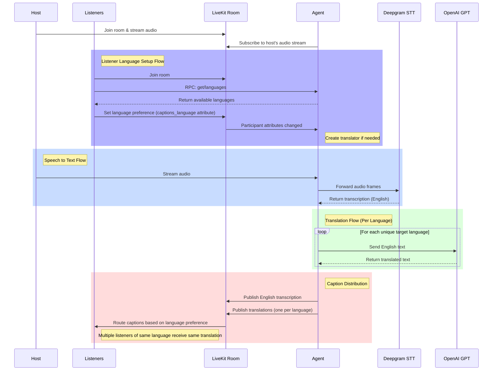

# Live AI-generated translations example

This is a demo of a LiveKit agent that connects to a live streaming session and automatically transcribes and translates the host's speech into text captions for a target language. Every listener that connects to the session can set their preferred language and receive live captions of the host in that language.

It uses:
- 🌐 [LiveKit](https://github.com/livekit/livekit) for transport
- 🤖 [LiveKit Agents](https://github.com/livekit/agents) for the backend
- 👂 [Deepgram](https://deepgram.com) STT for transcriptions
- 🌍 [OpenAI GPT-4o](https://platform.openai.com/) for translations

## Under the hood

Here's what's happening in this demo:

1. When a new LiveKit room is created via a user joining a "party", an agent joins the party on the backend and subscribes to the host user's microphone stream. If no host is present, the agent will wait for one to arrive and subscribe to their mic stream.
2. When the host speaks, the agent receives their speech stream and runs it through a speech-to-text process to transcribe it to text. This demo currently uses Deepgram for transcriptions, but any STT provider can be used.
3. By default, every user's (including the host's) target language for captions is set to English.
4. If there are any users (including the host) connected to this session that have set their target language to a language other than English (currently the demo supports English, French, German, Spanish, and Japanese), the agent will additionally feed transcriptions coming from STT to a [Translator](/server/main.py#L34) for that target language.
5. The translator will take the text from STT and pass it as part of a prompt to an LLM, asking the LLM to translate the text to the target language.
6. The output from the LLM is then sent to users via STTForwarder and rendered by the client application.

## Running the demo

### Run the agent
1. `cd server`
2. `python -m venv .venv`
3. `source .venv/bin/activate`
4. `pip install -r requirements.txt`
5. `cp .env.example .env`
6. add values for keys in `.env`
7. `python main.py dev`

### Run the client
1. `cd client/web`
2. `pnpm i`
3. `cp .env.example .env.local`
4. add values for keys in `.env.local`
5. `pnpm dev`
6. open a browser and navigate to `http://localhost:3000`

## Notes
- For this demo, there can only be *one host*.
- There's a couple known bugs at the moment:
  -  Sometimes joining as a listener ends up showing the agent as the host and things look broken. A refresh and rejoin should fix it.
  -  Opening more than one browser window and connecting a host and one-or-more listeners somehow degrades STT performance. Not sure why yet.
- You can easily extend this demo to support other languages by editing the [list of languages](/server/main.py#L36) in the agent code.

## Misc
For a more general overview of LiveKit Agents and the full set of capabilities, documentation is here: [https://docs.livekit.io/agents/](https://docs.livekit.io/agents/)
